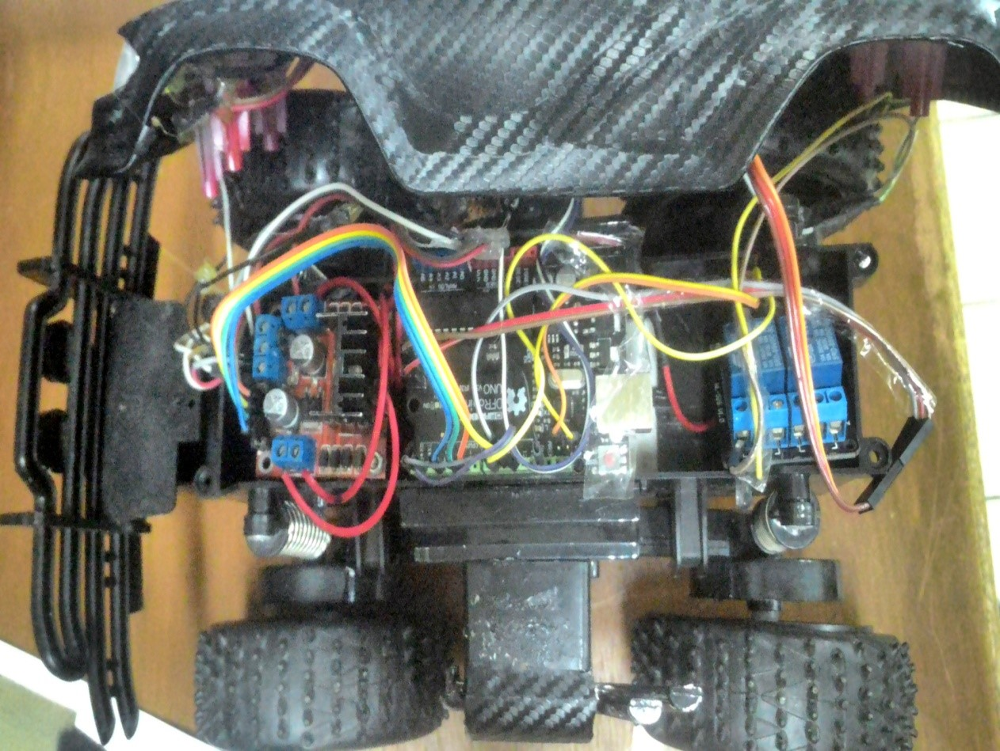
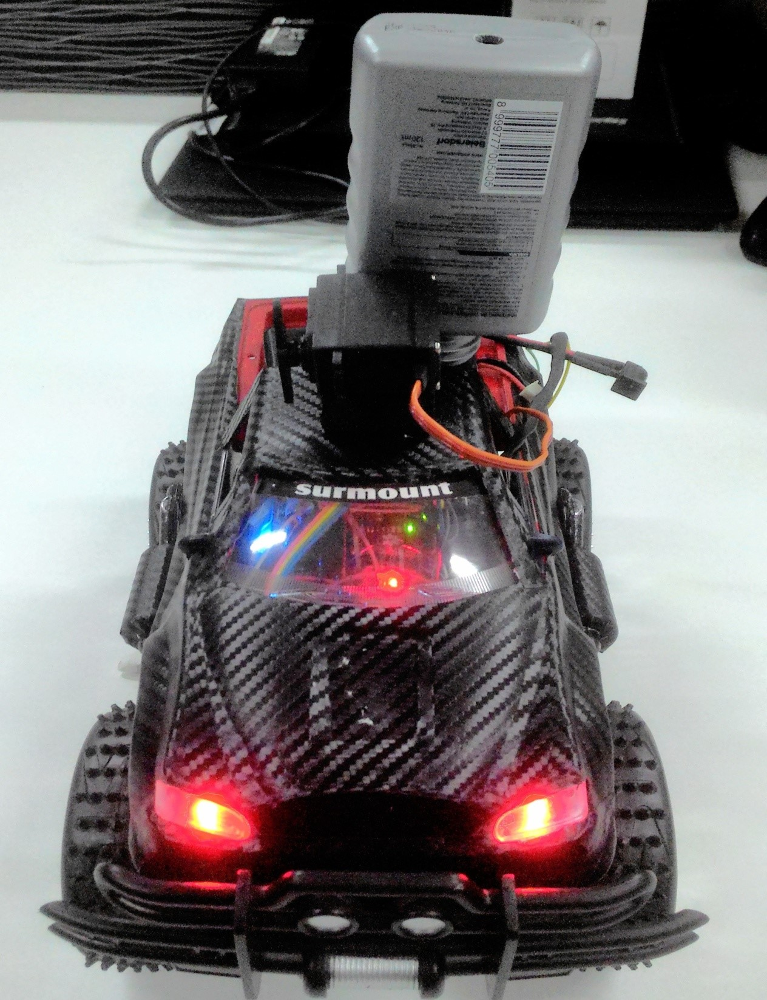
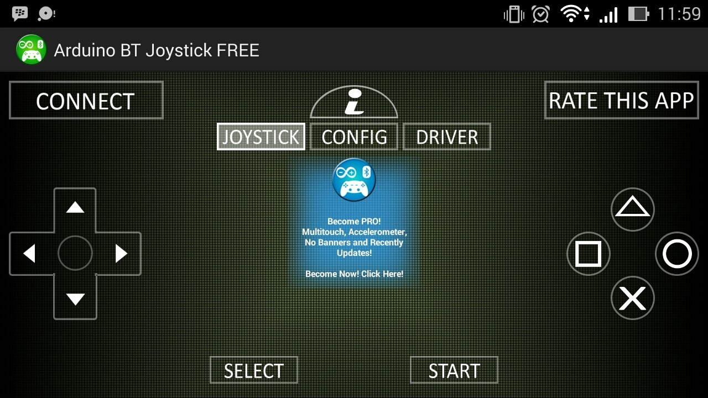

# FireBot Offroad 🚒

**FireBot Offroad** is an Arduino-based firefighting robot designed for offroad environments. It is controlled via Bluetooth from an Android device and can move in different directions, spray water using a servo-controlled nozzle, and stop or change speeds as needed.

## Interface

 
 
 

## Features

- **Bluetooth Control**: Control the robot's movements and water spray using an Android device.
- **Servo-Controlled Spray Nozzle**: The robot's nozzle can be opened or closed via servo control to spray water when necessary.
- **Multiple Movement Options**: The robot can move forward, backward, rotate left, rotate right, and rotate in place.
- **Max Speed Mode**: A mode to set the robot to its maximum speed for faster movement.
- **Offroad Capability**: Designed to navigate difficult terrain during firefighting missions.

## Components Used

- **Arduino UNO**: The brain of the robot.
- **Bluetooth Module**: To receive control commands from an Android device.
- **Servo Motor**: Controls the spray nozzle.
- **Motors**: For movement (forward, backward, rotate).
- **Water Pump/Nozzle**: Sprays water when needed.

## Pin Configuration

- **Motor 1**: Pins 5 and 3
- **Motor 2**: Pins 11 and 6
- **Servo**: Pin 10
- **Water Pump/Spray**: Pin 9

## Bluetooth Control Commands

- **'1'**: Rotate left
- **'2'**: Rotate right
- **'3'**: Move backward
- **'4'**: Move forward
- **'5'**: Rotate quickly
- **'6'**: Move at max speed
- **'7'**: Close the spray nozzle
- **'8'**: Open the spray nozzle
- **'A'**: Start spraying water
- **'9'**: Stop spraying water

## How It Works

1. **Control with Android**: Use a Bluetooth-enabled Android device to send commands to the robot.
2. **Movement**: The robot receives commands to move forward, backward, or rotate in either direction. It can also switch to a max speed mode.
3. **Spraying Water**: The water pump is activated by Bluetooth command 'A', and deactivated by command '9'. The spray nozzle's angle is controlled by a servo, which can open and close based on commands.

## Installation

1. Connect the Arduino to your robot hardware (motors, servo, and water pump).
2. Upload the provided Arduino sketch to the Arduino UNO.
3. Pair your Android device with the robot’s Bluetooth module.
4. Use any Bluetooth terminal app to send control commands.

## Code Explanation

The provided code controls the robot's movements, servo for spray nozzle, and motor speeds. It uses the `Servo.h` library to control the servo and manages motor speed via PWM (Pulse Width Modulation) through the `analogWrite()` function. The system is controlled by Bluetooth commands that are read through `Serial.read()`.

## Future Improvements

- Adding camera functionality for real-time video feedback.
- Integrating sensors to improve navigation in offroad conditions.

## License

This project is open-source and available under the [MIT License](https://opensource.org/licenses/MIT).
